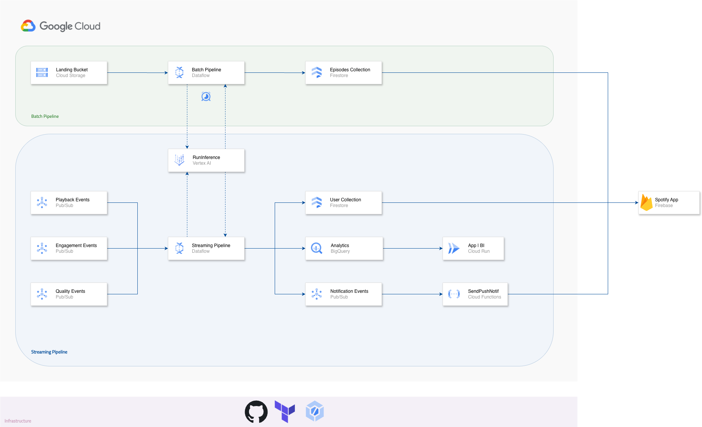
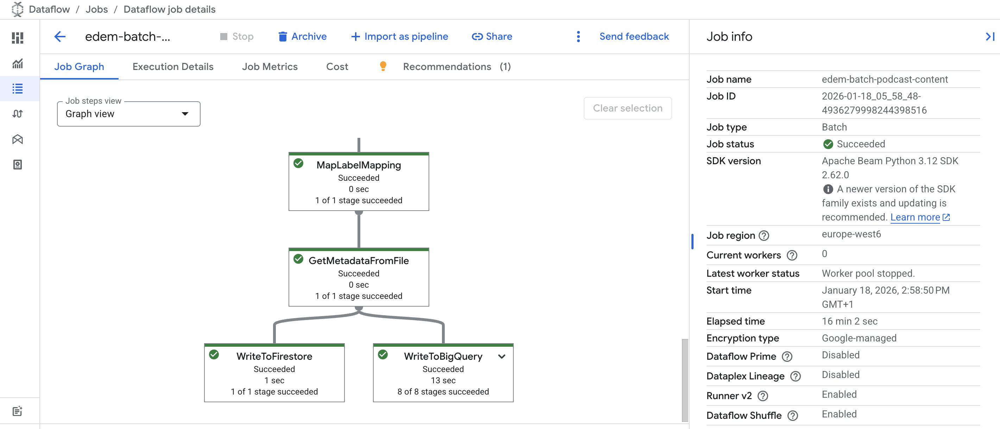
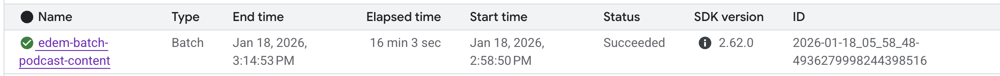
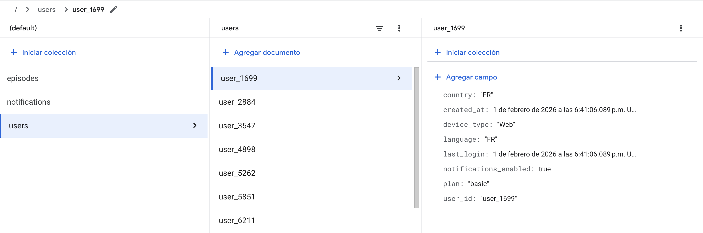
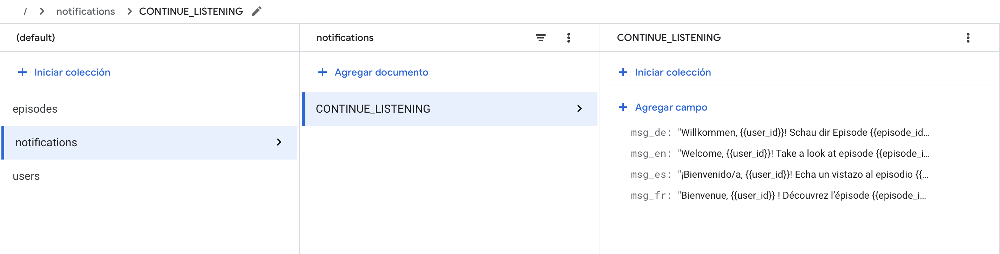

# Serverless Data Processing in Google Cloud
EDEM 2026

- Professors: 
    - [Javi Briones](https://github.com/jabrio)
    - [Adriana Campos](https://github.com/AdrianaC304)

#### Case description


Spotify seeks to enhance the listening experience of podcast users by combining offline content enrichment with real-time personalization. Podcast episodes uploaded to the platform must be processed to extract meaningful information from audio content, including audio transcription and thematic labelling, as well as the processing and optimization of visual assets used for content discovery across the platform.

At the same time, Spotify must process real-time user interaction data generated during listening sessions to compute live metrics, dynamically adapt recommendations, and trigger notifications when relevant. The system must handle continuous streams of user events, combine them with enriched content information, and react within seconds to changes in user behavior.

#### Business challenges

- Transform unstructured audio into structured information through transcription and labelling.

- Process and optimize visual assets associated with podcast content, while detecting and properly cataloging sensitive content to ensure a safe and compliant listening experience.

- Compute metrics and recommendations in real time during listening sessions and deliver timely notifications based on user behavior and content relevance.

- Design an architecture capable of supporting millions of concurrent listeners while maintaining consistency between offline and real-time data processing.

#### Homework Assignment

- The infrastructure must be managed as a Terraform project, allowing the entire architecture to be deployed seamlessly with a single **terraform apply** command. **[Homework Assignment]**

#### Data Architecture


## Setup Requirements

- [Google Cloud Platform - Free trial](https://console.cloud.google.com/freetrial)
- [Install Cloud SDK](https://cloud.google.com/sdk/docs/install)
- Clone this **repo**
- For this demo, we will be able to work both **locally** and in the **cloud shell**.
- Run this command to authenticate yourself with your GCP account (only locally).

```
    gcloud init
    gcloud auth application-default login
```

- Enable required *Google Cloud APIs* by running the following commands:

```
gcloud services enable dataflow.googleapis.com
gcloud services enable pubsub.googleapis.com
gcloud services enable vision.googleapis.com
gcloud services enable cloudbuild.googleapis.com
gcloud services enable cloudfunctions.googleapis.com
gcloud services enable run.googleapis.com
gcloud services enable logging.googleapis.com
gcloud services enable artifactregistry.googleapis.com
gcloud services enable eventarc.googleapis.com
gcloud services enable firestore.googleapis.com
gcloud services enable secretmanager.googleapis.com
```

- Create a Python environment using Anaconda, selecting **Python 3.12** as the version.

- **Activate** the recently created environment.
```
conda activate <ENVIRONTMENT_NAME>
```

*Alternatively, you can use venv, ensuring that your Python version is **3.12***

- Create Python environment (Windows - Using CMD terminal)
```
python -m venv <ENVIRONTMENT_NAME>
<ENVIRONMENT_NAME>\Scripts\activate.bat
```

- Create Python Environment (Mac)
```
python -m venv <ENVIRONTMENT_NAME>
source <ENVIRONMENT_NAME>/bin/activate
```

- Install python dependencies by running the following command:

```
cd /GCP
pip install -r requirements.txt
```

## PubSub

Go to the [Google Pub/Sub console](https://console.cloud.google.com/cloudpubsub) and **create the necessary topics** to simulate the different data sources, making sure to check the option to create a default subscription. These topics will be responsible for collecting all data emitted by user actions.

## Google Cloud Storage

Now, go to the [Google Cloud Storage](https://console.cloud.google.com/storage) and create two buckets. These buckets must have a **globally unique name**, be **regional**, and will serve as storage for temporary and staging files that Dataflow will need during its execution, as well as for server storage.

- A command to upload the necessary audio and image files to the corresponding storage locations for the practice:

```
cd ./02_Code/00_Dataflow/00_DocAux
gsutil cp -r * gs://<YOUR_BUCKET_NAME>/
```

- Set the required file metadata

```
gsutil setmeta \
  -h "x-goog-meta-title:Passive Income Expert: Buying A House Makes You Poorer Than Renting! Crypto Isn't A Smart Investment" \
  -h "x-goog-meta-duration:2:15:03" \
  -h "x-goog-meta-show_id:The Diary Of A CEO" \
  -h "x-goog-meta-status:processed" \
  -h "x-goog-meta-episode_id:ep_2020" \
  -h "x-goog-meta-duration_sec:6739" \
  gs://<YOUR_BUCKET_NAME>/audio/podcast_audio.wav
```

```
gsutil setmeta \
  -h "x-goog-meta-title:Thierry Henry: I Was Depressed, Crying & Dealing With Trauma." \
  -h "x-goog-meta-duration:1:54:12" \
  -h "x-goog-meta-show_id:The Diary Of A CEO" \
  -h "x-goog-meta-status:processed" \
  -h "x-goog-meta-episode_id:ep_2021" \
  -h "x-goog-meta-duration_sec:7491" \
  gs://<YOUR_BUCKET_NAME>/audio/podcast_audio_02.wav
```

```
gsutil setmeta \
  -h "x-goog-meta-episode_id:ep_2021" \
  gs://<YOUR_BUCKET_NAME>/images/doac_cover.jpg
```

## Google Cloud Firestore

Go to the [Google Cloud Firestore Console](https://console.cloud.google.com/firestore) and create a database **(default) in native mode**. This will allow us to store all the data sent by the different systems.

## Google Cloud Artifact Registry

-  As a first step, go to the [Artifact Registry Console](https://console.cloud.google.com/artifacts) and create a repository with the default values. Alternatively, you can create it using the CLI:

```
gcloud artifacts repositories create <YOUR_REPOSITORY_NAME> \
 --repository-format=docker \
 --location=<YOUR_REGION_ID>
```

- Run the following command to ensure that Docker is properly configured to authenticate with Artifact Registry.

```
gcloud auth configure-docker <YOUR_REGION_ID>-docker.pkg.dev
```

## Run Dataflow

#### A. Batch

```
cd ./GCP/02_Code/00_Dataflow/01_Batch
```

- From **Local**

```
python edem_podcast_content_processing_batch.py \
    --project_id <YOUR_PROJECT_ID> \
    --bucket_name <YOUR_BUCKET_NAME> \
    --firestore_collection <YOUR_FIRESTORE_COLLECTION_NAME> \
    --bigquery_dataset <YOUR_BIGQUERY_DATASET_NAME> \
    --bigquery_table <YOUR_AUDIO_BIGQUERY_TABLE_NAME>
```

```
python edem_thumbnail_processing_batch.py \
    --project_id <YOUR_PROJECT_ID> \
    --bucket_name <YOUR_BUCKET_NAME> \
    --firestore_collection <YOUR_FIRESTORE_COLLECTION_NAME> \
    --bigquery_dataset <YOUR_BIGQUERY_DATASET_NAME> \
    --bigquery_table <YOUR_IMAGE_BIGQUERY_TABLE_NAME>
```

- Run Pipeline in GCP: **Dataflow**

```
python edem_podcast_content_processing_batch.py \
    --project_id <YOUR_PROJECT_ID> \
    --bucket_name <YOUR_BUCKET_NAME> \
    --firestore_collection <YOUR_FIRESTORE_COLLECTION_NAME> \
    --bigquery_dataset <YOUR_BIGQUERY_DATASET_NAME> \
    --bigquery_table <YOUR_AUDIO_BIGQUERY_TABLE_NAME> \
    --runner DataflowRunner \
    --job_name <YOUR_DATAFLOW_JOB_NAME> \
    --region <YOUR_REGION_ID> \
    --temp_location gs://<YOUR_GCS_BASE_BUCKET>/tmp \
    --staging_location gs://<YOUR_GCS_BASE_BUCKET>/stg \
    --requirements_file ./requirements.txt
```

```
python edem_thumbnail_processing_batch.py \
    --project_id <YOUR_PROJECT_ID> \
    --bucket_name <YOUR_BUCKET_NAME> \
    --firestore_collection <YOUR_FIRESTORE_COLLECTION_NAME> \
    --bigquery_dataset <YOUR_BIGQUERY_DATASET_NAME> \
    --bigquery_table <YOUR_IMAGE_BIGQUERY_TABLE_NAME> \
    --runner DataflowRunner \
    --job_name <YOUR_DATAFLOW_JOB_NAME> \
    --region <YOUR_REGION_ID> \
    --temp_location gs://<YOUR_GCS_BASE_BUCKET>/tmp \
    --staging_location gs://<YOUR_GCS_BASE_BUCKET>/stg \
    --requirements_file ./requirements.txt
```





- Model Output (Speech to Text,Label Detection & SafeSearch)


```
Results for SpeechToText:
  Transcription: "On the other side, if you have a mortgage rate that's say 6% or higher, well, when you pay off that mortgage, essentially you're locking in a guaranteed return of that interest rate..."
  Label: business
```

```
Results for SafeSearch:
  is_sensitive: False
```

#### B. Streaming

```
cd ./GCP/02_Code/00_Dataflow/02_Streaming
```

- Run **Generator**

```
python edem_data_generator.py \
    --project_id <PROJECT_ID> \
    --playback_topic <YOUR_PLAYBACK_PUBSUB_TOPIC_NAME> \
    --engagement_topic <YOUR_ENGAGEMENT_PUBSUB_TOPIC_NAME> \
    --quality_topic <YOUR_QUALITY_PUBSUB_TOPIC_NAME> \
    --firestore_collection <YOUR_FIRESTORE_COLLECTION> 
```

- Run Streaming pipeline **locally**:

```
python edem_realtime_recommendation_engine.py \
    --project_id <PROJECT_ID> \
    --playback_pubsub_subscription_name <YOUR_PLAYBACK_PUBSUB_SUBSCRIPTION_NAME> \
    --engagement_pubsub_subscription_name <YOUR_ENGAGEMENT_PUBSUB_SUBSCRIPTION_NAME> \
    --quality_pubsub_subscription_name <YOUR_QUALITY_PUBSUB_SUBSCRIPTION_NAME> \
    --notifications_pubsub_topic <YOUR_NOTIFICATION_PUBSUB_TOPIC_NAME> \
    --firestore_collection <YOUR_FIRESTORE_COLLECTION> \
    --bigquery_dataset <YOUR_BIGQUERY_DATASET> \
    --user_bigquery_table <YOUR_USER_BIGQUERY_TABLE> \
    --episode_bigquery_table <YOUR_EPISODE_BIGQUERY_TABLE> 
```

- Run Pipeline in GCP: **Dataflow**

```
python edem_realtime_recommendation_engine.py \
    --project_id <PROJECT_ID> \
    --playback_pubsub_subscription_name <YOUR_PLAYBACK_PUBSUB_SUBSCRIPTION_NAME> \
    --engagement_pubsub_subscription_name <YOUR_ENGAGEMENT_PUBSUB_SUBSCRIPTION_NAME> \
    --quality_pubsub_subscription_name <YOUR_QUALITY_PUBSUB_SUBSCRIPTION_NAME> \
    --notifications_pubsub_topic <YOUR_NOTIFICATION_PUBSUB_TOPIC_NAME> \
    --firestore_collection <YOUR_FIRESTORE_COLLECTION> \
    --bigquery_dataset <YOUR_BIGQUERY_DATASET> \
    --user_bigquery_table <YOUR_USER_BIGQUERY_TABLE> \
    --episode_bigquery_table <YOUR_EPISODE_BIGQUERY_TABLE> \
    --runner DataflowRunner \
    --job_name <YOUR_DATAFLOW_JOB_NAME> \
    --region <YOUR_REGION_ID> \
    --temp_location gs://<YOUR_GCS_BASE_BUCKET>/tmp \
    --staging_location gs://<YOUR_GCS_BASE_BUCKET>/stg \
    --requirements_file ./requirements.txt
```

## Dataflow Flex Templates

- Build Dataflow Flex Template

```
gcloud dataflow flex-template build gs://<YOUR_BASE_BUCKET_NAME>/<YOUR_TEMPLATE_NAME>.json \
    --image-gcr-path "<YOUR_REGION_ID>-docker.pkg.dev/<YOUR_PROJECT_ID>/<YOUR_REPOSITORY_NAME>/<YOUR_IMAGE_NAME>:latest" \
    --sdk-language "PYTHON" \
    --flex-template-base-image "PYTHON3" \
    --py-path "." \
    --env "FLEX_TEMPLATE_PYTHON_PY_FILE=<YOUR_PATH_TO_THE_PY_FILE>" \
    --env "FLEX_TEMPLATE_PYTHON_REQUIREMENTS_FILE=YOUR_PATH_TO_THE_REQUIREMENTS_FILE"
```

- Run Dataflow Flex Template

```
gcloud dataflow flex-template run "<YOUR_DATAFLOW_JOB_NAME>" \
 --template-file-gcs-location="gs://<YOUR_BUCKET_NAME>/<YOUR_TEMPLATE_NAME>.json" \
 --parameters project_id="<PROJECT_ID>",playback_pubsub_subscription_name="<YOUR_PLAYBACK_PUBSUB_SUBSCRIPTION_NAME>",engagement_pubsub_subscription_name="<YOUR_ENGAGEMENT_PUBSUB_SUBSCRIPTION_NAME>",quality_pubsub_subscription_name="<YOUR_QUALITY_PUBSUB_SUBSCRIPTION_NAME>",notifications_pubsub_topic_name="<YOUR_NOTIFICATION_PUBSUB_TOPIC_NAME>",firestore_collection="<YOUR_FIRESTORE_COLLECTION>",bigquery_dataset="<YOUR_BIGQUERY_DATASET>",user_bigquery_table="<YOUR_USER_BIGQUERY_TABLE>",episode_bigquery_table="<YOUR_EPISODE_BIGQUERY_TABLE>" \
 --region=<YOUR_REGION_ID> \
 --max-workers=1
```

## CI/CD: Cloud Build

- Go to the [Cloud Build console](https://console.cloud.google.com/cloud-build)
- In the left panel, select *Repositories*.
- In the *2nd Gen* tab, click on **Link Repository**.
- In the *Connection* dropdown, click on **Create host connection** and link your GitHub account:
    - Select only the repositories associated with your account that you want to link.
    - Click install.
    - Verify that the connection is created successfully.

- In the left panel, select *Triggers*.
    - Give it a name and select a specific region.
    - The event will be **Push to a branch**.
    - In *Repository*, connect to a new repository and s**elect the repository previously chosen in the connection**.
    - Click on **Connect**.
    - Select the **branch** this trigger will listen for changes on.
    - As configuration, select **Cloud Build configuration file (yaml or json)**.
    - For location, add the path to your proper [build.yml](./02_Code/03_CICD) file. Alternatively, you can select inline and copy and paste the content of the file.
    - Select a service account with sufficient permissions to execute a Dataflow job (*If you do not specify a service account, it will use the default Compute Engine service account*)
    - Click on **Create**.

- Once the trigger is created, each new push to the specified branch will trigger the actions specified in the build file, following the steps we set.


## Cloud Functions

#### Notification Events

Previously, you published a message with user information to a Pub/Sub topic. Now, we are going to retrieve that message and display it. First, we check that the topic exists and make sure we are using the correct one:

```
gcloud pubsub topics list
```

You have a message like this in the topic:

``` json
{
  "notification_id": "e4f1c2d3-5a67-4b89-b123-9f0a1bc2d345",
  "created_at": "2026-02-01T12:34:56.789Z",
  "type": "CONTINUE_LISTENING",
  "user_id": "user_6211",
  "ttl_sec": 1800,
  "payload": {
    "episode_id": "episode_007",
    "resume_position_sec": 125
  }
}
```

In addition, you have a Firestore collection with Spotify users and their preferred language.




We are going to create a new Firestore collection for CONTINUE_LISTENING notifications:

```
cd ./GCP/02_Code/01_CloudFunction/NotificationEvents
```

```
python edem_notification_creation.py \
    --firestore_collection <FIRESTORE_NAME> \
    --project_id <PROJECT_ID>
```

You will see something like this:




We will deploy the function. This function takes the user_id from the topic and returns a notification message in the user’s default language. 

In this case, the trigger name matches the topic name. Every time a message arrives, the function outputs a message to the console in the Spotify user's default language.


1. Receives a Pub/Sub event triggered by a message published to a Pub/Sub topic.

2. Reads the fields of the Pub/Sub message:
   - `user_id`
   - `type`
   - `episode_id`

3. Processes only messages of type `CONTINUE_LISTENING`.

4. Retrieves the user’s preferred language from Firestore.

5. Reads the **Notification** collection in Firestore to select the appropriate name.

6. Selects the correct language template based on the user's preference.

7. Replaces the template placeholders:
   - `{{user_id}}`
   - `{{episode_id}}`
   with the actual values.

8. Displays the message in the user’s preferred language.


```
gcloud functions deploy notification \
    --gen2 \
    --region=europe-west1 \
    --runtime=python310 \
    --trigger-topic=YOUR_PUBSUB_TOPIC \
    --entry-point=notification \
    --project=YOUR_PROJECT_ID
```

To allow the Pub/Sub topic to invoke the function, we need to grant the required permissions.

```
gcloud functions add-iam-policy-binding notification \
    --region europe-west1 \
    --member="serviceAccount:<YOUR_SERVICE_ACCOUNT>" \
    --role="roles/run.invoker"
```


## Cloud Run

Once we’ve reviewed the full architecture, this exercise should help with decision-making in a real project.

It shouldn’t remain as an unresolved process. Therefore, we will create a dashboard using Streamlit.

```
cd ./GCP/02_Code/02_CloudRun
```


Build and push the Docker image to Artifact Registry. Run the following command from the project directory: 

```
gcloud builds submit \
  --tag <REGION>-docker.pkg.dev/<PROJECT_ID>/<ARTIFACT_REPOSITORY>/<IMAGE_NAME>:latest .
```

After building the image, deploy it to Cloud Run:

```
gcloud run deploy dashboard \
  --image <REGION>-docker.pkg.dev/<PROJECT_ID>/<ARTIFACT_REPOSITORY>/<IMAGE_NAME>:latest \
  --platform managed \
  --region <REGION> \
  --allow-unauthenticated
```


Certain organizations do not have permission to make URLs public due to organizational restrictions. 

This command allows you to access the service as if it were running locally, without changing permissions or making it public. It lets you test private services without exposing them publicly.


```
gcloud run services proxy <SERVICE_NAME> --region=<REGION> 
```

Open your browser and go to:

http://127.0.0.1:8080/


***Tasks***

- Modify main.py and create a new version.
- Add a navigation menu to simulate a real web application.
- Add new visualizations/charts.


## Cloud Functions

#### Event-Driven Transcription

From a real-world project perspective, there are cases where data needs to be processed in real time. As soon as new data arrives, the entire workflow must be triggered automatically.

```
cd ./GCP/02_Code/01_CloudFunction/Transcribe
```

As a first step, we create a second-generation Cloud Function that receives the event and writes the data to Firestore.

```
gcloud functions deploy transcribe \
    --gen2 \
    --runtime python311 \
    --trigger-event google.cloud.storage.object.v1.finalized \
    --trigger-resource <YOUR_BUCKET_NAME> \
    --region <YOUR_REGION> \
    --memory 512MB \
    --entry-point transcribe \
    --set-env-vars BUCKET_NAME=<YOUR_BUCKET_NAME>,FIRESTORE_COLLECTION=<YOUR_FIRESTORE_COLLECTION>
```

In order to invoke the function from the bucket, we need to grant it the necessary permissions.

```
gcloud functions add-iam-policy-binding transcribe \
    --region <YOUR_REGION> \
    --member="serviceAccount:<YOUR_SERVICE_ACCOUNT>" \
    --role="roles/run.invoker"
```

## Clean Up

- List your Dataflow pipelines 

```
gcloud dataflow jobs list --region=<YOUR_REGION_ID>
```

- Stop the dataflow job:

```
gcloud dataflow jobs cancel <YOUR_JOB_ID> --region=<YOUR_REGION_ID>
```

- Remove your PubSub Topics and Subscriptions

```
gcloud pubsub topics delete <YOUR_TOPIC_NAME>
gcloud pubsub subscriptions delete <YOUR_SUBSCRIPTION_NAME>
```

- Remove your Artifact Registry Repository

```
gcloud artifacts repositories delete <YOUR_REPOSITORY_NAME> --location=<YOUR_REGION_ID>
```

- Remove your Cloud Function

```
gcloud functions delete <YOUR_CLOUD_FUNCTION_NAME> --region <YOUR_REGION_ID>
```

- Remove your Cloud Run Service

```
gcloud run services delete <YOUR_CLOUR_RUN_SERVICE_NAME> --platform=managed --region=<YOUR_REGION_ID>
```

- Remove your Cloud Run Job

```
gcloud run jobs delete <YOUR_CLOUD_RUN_JOB_NAME> --region=<YOUR_REGION_ID>
```

- Disable the required Google APIs

```
gcloud services disable dataflow.googleapis.com
gcloud services disable pubsub.googleapis.com
gcloud services disable vision.googleapis.com
gcloud services disable cloudbuild.googleapis.com
gcloud services disable cloudfunctions.googleapis.com
gcloud services disable run.googleapis.com
gcloud services disable logging.googleapis.com
gcloud services disable artifactregistry.googleapis.com
gcloud services disable eventarc.googleapis.com
gcloud services disable firestore.googleapis.com
gcloud services disable secretmanager.googleapis.com

```

## Bibliography & Additional Resources

- Dataflow

    - [Apache Beam Basics](https://beam.apache.org/documentation/programming-guide/)
    
    - [Apache Beam ML](https://beam.apache.org/documentation/ml/about-ml/)
    
    - [Dataflow Flex Templates](https://cloud.google.com/dataflow/docs/guides/templates/using-flex-templates)
    
    - [Dataflow Practical Exercises Guide](https://cloud.google.com/dataflow/docs/guides/)

- IAM
    - https://cloud.google.com/iam/docs/service-accounts-create
    - https://cloud.google.com/iam/docs/understanding-roles
 
- Firestore
    - https://firebase.google.com/docs/firestore/quickstart#python

- Cloud Functions
    - https://cloud.google.com/functions/docs/console-quickstart

- Artifact Registry
    - https://cloud.google.com/artifact-registry/docs/repositories/create-repos

- Cloud Run
    - https://cloud.google.com/run/docs/deploying
    - https://cloud.google.com/sql/docs/postgres/connect-run
